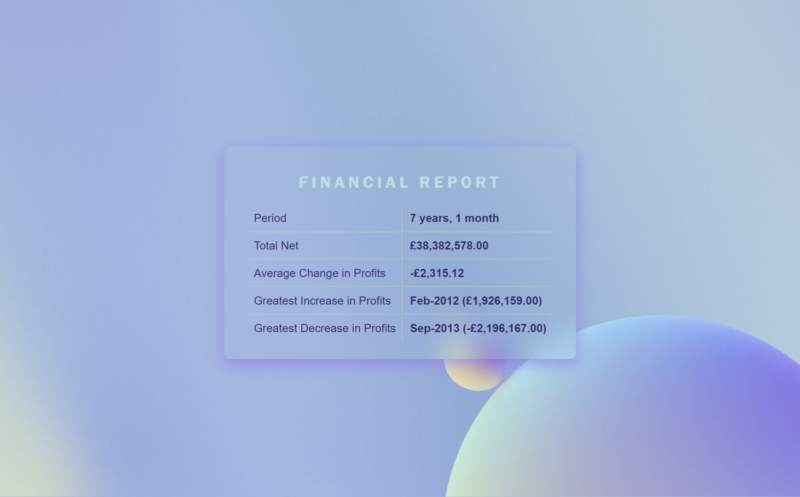

# Console Finances

Bootcamp Week 4 Challenge: Create code for analyzing the financial records of a company. :purple_heart:

## About

Given: a dataset composed of arrays with two fields, Date and Profit/Losses.

Task: write JavaScript code that analyzes the records to calculate each of the following:

- [x] The total number of months included in the dataset.

- [x] The net total amount of Profit/Losses over the entire period.

- [x] The average of the **changes** in Profit/Losses over the entire period.

- [x] The greatest increase in profits (date and amount) over the entire period.

- [x] The greatest decrease in profits (date and amount) over the entire period.

All data to be logged in console.

- Extra: Added HTML markup and display of data via JavaScript.

[View the project](https://alexandrabatrak.github.io/console-finances) :receipt:

## Credits

Background image by [Milad Fakurian @Unsplash](https://unsplash.com/photos/PGdW_bHDbpI)

Obtained information and snippets:

- Main functions

  - Sum in arrays: [1](https://www.tutorialspoint.com/how-to-sum-all-elements-in-a-nested-array-javascript),[2](https://www.quora.com/What-is-the-best-algorithm-to-sum-numbers-in-nested-arrays),[3](https://bobbyhadz.com/blog/javascript-get-sum-of-array-of-numbers)
  - Index of max value in array: [1](https://bobbyhadz.com/blog/javascript-get-index-of-max-value-in-array)
  - Snippet for average difference calculations (Array.reduce): Olena Pelagenko @ljenchik :raised_hands:

- Extras

  - [Difference between two dates](https://stackoverflow.com/questions/17732897/difference-between-two-dates-in-years-months-days-in-javascript)
  - [Numbers format](https://stackoverflow.com/questions/149055/how-to-format-numbers-as-currency-strings)

## Licence

Licenced under the [MIT](/LICENSE) license.

*Copyright © 2023 Alexandra Batrak*
